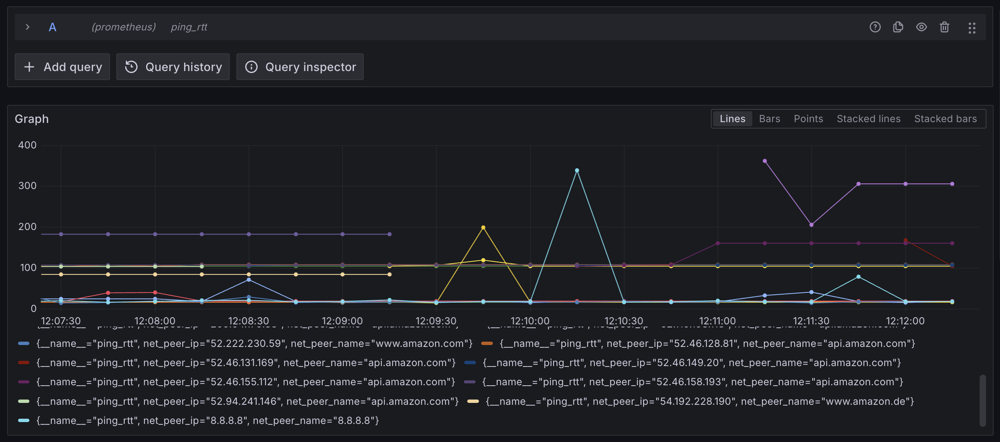

# OpenTelemetry Collector - ICMP Check Receiver

This receiver executes ICMP echo/ping requests to a list of targets and reports the results as metrics.

Features:

* List of created metrics:
  * `ping_rtt`: Round-trip time in milliseconds.
  * `ping_rtt_min`: Minimum round-trip time in milliseconds.
  * `ping_rtt_max`: Maximum round-trip time in milliseconds.
  * `ping_rtt_avg`: Average round-trip time in milliseconds.
  * `ping_rtt_stddev`: Standard deviation of round-trip time in milliseconds.
  * `ping_loss_ratio`: Packet loss ratio between 0 and 1.
* Name resolution errors will be logged as warnings and the target will be retried in the next scrape run.

Example Grafana visualization:


## Configuration

The receiver supports the following settings:

- `collection_interval`: The interval (duration, e.g. 1m) at which the scraper will run. See [scrapehelper](https://github.com/open-telemetry/opentelemetry-collector/blob/main/receiver/scraperhelper/config.go) for all options.
- `targets`: A list of targets to ping.

  target:
  - `target`: The target to ping. This can be an IP address or hostname.
  - `ping_count`: The number of pings to send to the target.
  - `ping_timeout`: The timeout (duration, e.g. 5s) for this target. If `ping_count` pings are not received within this time, the execution will be stopped.

Example configuration:
```yaml
receivers:
  icmpcheck:
    collection_interval: 10s
    targets:
      - target: www.amazon.de
        ping_count: 4
        ping_timeout: 5s
      - target: www.amazon.com
      - target: www.doesnot123exiiiiist.coom
      - target: api.amazon.com
      - target: api.amazon.de # request timeout
        ping_timeout: 2s
      - target: 8.8.8.8

exporters:
  debug:
    verbosity: detailed

service:
  pipelines:
    metrics:
      receivers: [icmpcheck]
      exporters: [debug]
```

## Usage

The receiver can be used in a [custom collector build](https://opentelemetry.io/docs/collector/custom-collector/).

Example builder manifest file:
```yaml
dist:
  name: otelcol-dev
  description: Basic OTel Collector distribution for Developers
  output_path: ./otelcol-dev
  otelcol_version: 0.111.0

exporters:
  - gomod: go.opentelemetry.io/collector/exporter/debugexporter v0.111.0

processors:
  - gomod: go.opentelemetry.io/collector/processor/batchprocessor v0.111.0

receivers:
  - gomod: github.com/thmshmm/icmpcheckreceiver v0.1.0
```
